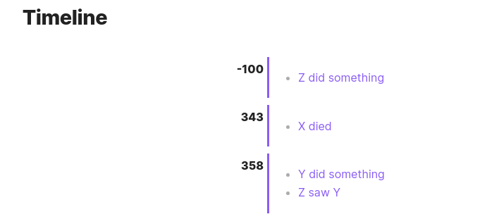

# File Based Timeline Obsidian Plugin

An Obsidian Plugin to help you create a timeline based on files in a folder.

## How to use

1. Create a folder in your vault where you will store the files that will be part of the timeline.
2. Create a note for each event you want to add to the timeline. The note should have any of the following time-related metadata:
  - `year` (e.g. `2021`)
  - `month` (e.g. `1`)
  - `day` (e.g. `1`)
  - `hour` (e.g. `12`)
  - `minute` (e.g. `30`)

3. Create a file where the timeline will be displayed. This file should have the following content:
```markdown
```fbtimeline
folder: path/to/timeline/folder
date: YYYY-MM-DD
```

4. The timeline will be displayed in the preview mode of the file or in live preview.

### Extra options

- `month` to customize the month and the month durations, like:

```markdown
```fbtimeline
folder: path/to/timeline/folder
date: YYYY-MM-DD
month: january,31
month: february,28
month: march,31
month: april,30
month: may,31
...
```

- `weekday` to customize the weekday names, like:

```markdown
```fbtimeline
...
weekday: Sunday
weekday: Monday
weekday: Tuesday
weekday: Wednesday
weekday: Thursday
weekday: Friday
weekday: Saturday
```

- `year` to customize the year length, like:

```markdown
```fbtimeline
...
year: 365
```

## Example

```markdown
```fbtimeline
folder: 01 - RPG/01 - Projeto Paratheos/Timeline
date: yyyy
```

## Screenshots

